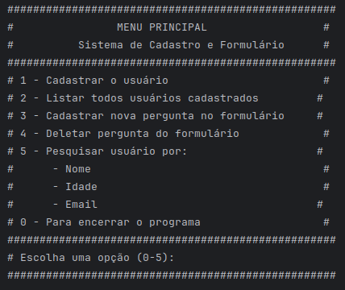

# Sistema de Cadastro CLI
Desafio proposto pelo Lucas Carrilho para a criação de um sistema simples de cadastro em CLI. 
O usuário poderá usar um sistema de CADASTRO via CLI (no terminal), em que o usuário vai poder cadastrar uma pessoa interessada, alterar seus dados, deletar uma pessoa, listar todas pessoas cadastradas, etc. <br><br>
---


### :dart: Objetivos do Desafio
- Orientação a Objetos
-  Java i.o
- Exceções
- Boas práticas de código
### :hammer_and_wrench: Tecnologia e Requisitos
 -  JavaJDK
##### :gear: Instalação
```bash
git clone https://github.com/cesar-404/cli-cadastro-devmagro
cd /cli-cadastro-devmagro
cd src/
java Main
